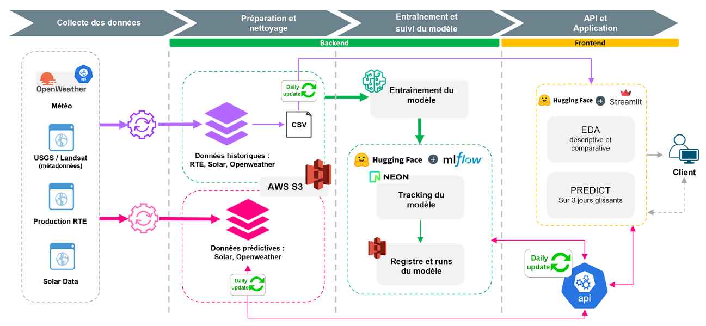

# REnergies_efficiency_prediction
Jedha bootcamp final project. Prediction of the Renewable energy sources output based on meteorological and spatial data

github link: https://github.com/Sheikoh/REnergies_efficiency_prediction_Lead.git

## Architecture Diagrams

### Simplified architecture

## How to use:

- The code folder contains the code associated with the different aspects of the project:
    - 01, 03, 05 contains all the ETL codes to fetch the data.
    - 02_Modeles contain the code relevant for the data processing and the model training.
    - 04_Dashboarding contains the files for the streamlit Dashboard deployed on hugging_face.
    - 06_Mlflow contains the files for the mlflow server deployed on hugging_face.
    - 09_API contains the files for the API deployed on hugging_face.
    - 10_Airflow contains the files to deploy an Airflow server locally.

- The .github/workflows contains the Github Actions necessary for the CI/CD.

## Data and modeling:

The model uses data from RTE production as a target, and data from the space weather and earth weather as variables.
The model is a simple linear regression performed after feature engineering.

